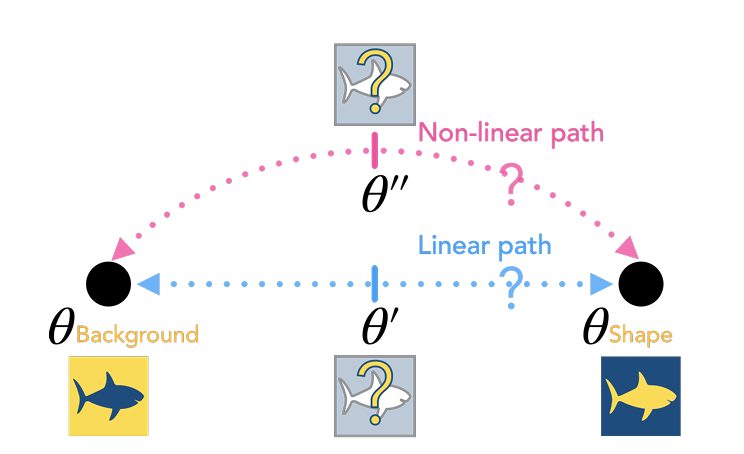

# Reproduced-Results

Welcome to the "Reproduced Results" repository! This repository aims to reproduce the results of existing 
published papers, validating their findings and promoting scientific transparency. Here, you will find 
the code and resources necessary to replicate the experiments and analyses conducted in the selected 
papers. The repository is organized into directories that house the code, data, and documentation 
associated with each reproduction effort. To get started, follow the installation instructions to set 
up any required dependencies. The README provides an overview of the reproduction process, including 
data preprocessing, model training, and evaluation steps. We have listed the referenced papers, 
including their titles, authors, publication venues, and relevant links. The results of our reproduction 
efforts are discussed, highlighting the alignment or deviations encountered compared to the original 
findings. Usage instructions are provided to run the reproduced code, specifying input data paths and 
necessary configurations. We welcome contributions from the community and have included guidelines for 
submitting pull requests or raising issues. Please refer to the license information for the terms of use. 
If you have any questions or feedback, feel free to reach out to us. Thank you for your interest in 
reproducing research results!

## [Mechanistic Mode Connectivity by Ekdeep Singh Lubana, Eric J. Bigelow, Robert P. Dick, David Krueger, Hidenori Tanaka](https://arxiv.org/abs/2211.08422)

In there research, they explored the characteristics of neural network loss landscapes by investigating mode 
connectivity. Mode connectivity refers to the observation that minimizers of neural networks obtained through 
training on a dataset can be connected by simple paths of low loss. There primary objective was to address the 
following question: Do minimizers that employ different mechanisms to make predictions exhibit connectivity 
through paths of low loss? To assess mechanistic similarity, they introduced a definition based on shared 
invariances to input transformations. They demonstrated that the absence of linear connectivity between two 
models indicates their use of dissimilar mechanisms for prediction. This finding has practical implications, as 
it highlights the limitations of naive fine-tuning on a new dataset to modify a model's mechanisms. For instance, 
fine-tuning may fail to eliminate a model's reliance on irrelevant attributes. Moreover, there analysis motivates 
the development of a method called connectivity-based fine-tuning (CBFT) for targeted modification of a model's 
mechanisms. They evaluated CBFT using synthetic datasets and its effectiveness in reducing a model's dependence on 
spurious attributes.

